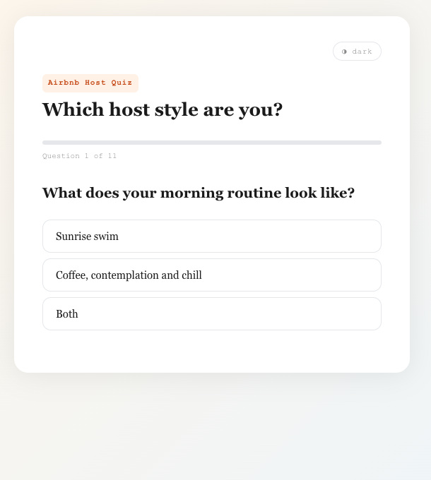
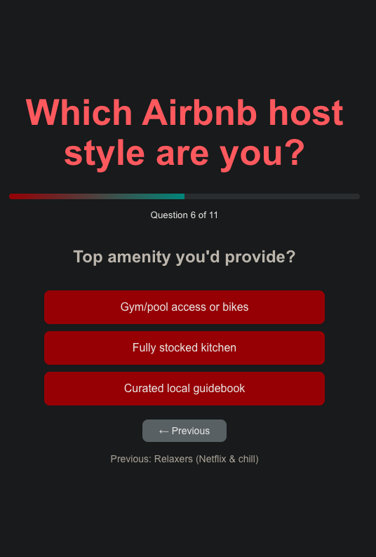
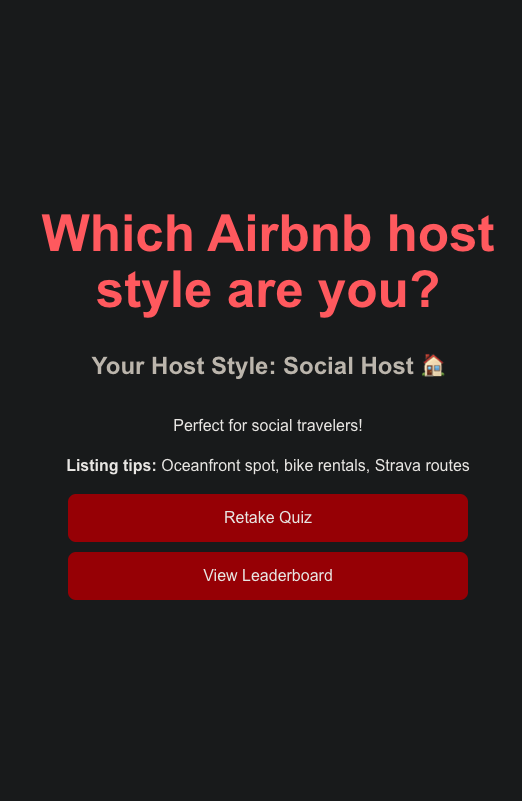
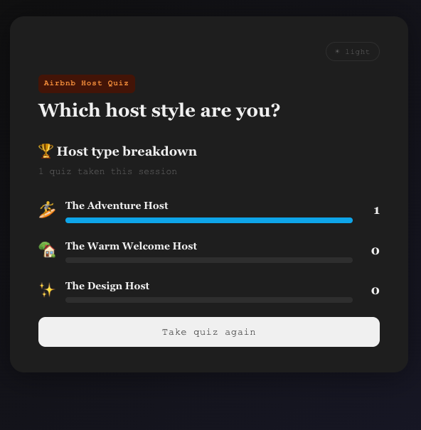

# Airbnb Host Personality Quiz

A React quiz app that analyzes 11 questions to classify you as one of three Airbnb host types — with personalized listing tips, a live leaderboard, and a real external API call.

**[→ Live Demo](https://host-quiz.vercel.app/)**






---

## What it does

Answer 11 questions about your hosting style — morning routine, guest preferences, conflict resolution, decor — and the app scores your answers across three dimensions (energy, social, style) to determine your host archetype. Each result comes with a personality description, four actionable listing tips, and a randomly fetched piece of advice from an external API.

---

## Tech stack

| Layer | Choice | Why |
|---|---|---|
| Framework | React 18 + Vite | Fast dev server, modern JSX transform |
| Styling | CSS Modules + custom properties | Scoped styles, zero class collisions |
| State | `useState` (6 hooks) | Right-sized for a single-component app |
| API | `adviceslip.com` | Free, no auth, demonstrates async/await |
| Deploy | Vercel | CI/CD on every push to main |

---

## Project structure

```
src/
├── App.jsx          # All components and logic
├── App.module.css   # Component-scoped styles
├── index.css        # Global reset, CSS custom properties
└── assets/          # Screenshot images for README
```

---

## Architecture

```
User answers question
        ↓
useState tracks answers array
        ↓
On final answer → scoreAnswers(answers)
        ↓
for loop counts keyword matches per host type
        ↓
Object.keys().reduce() finds highest score
        ↓
Result screen renders + fetchHostingTip() fires
        ↓
Async fetch → adviceslip API → tip renders on success
```

---

## Scoring algorithm

The scoring function loops through all 11 answers and matches keywords to host types. The highest score wins.

```js
function scoreAnswers(answers) {
  let energy = 0, social = 0, style = 0;

  for (let i = 0; i < answers.length; i++) {
    const a = answers[i];
    if (a.includes("swim") || a.includes("Endurance") || a.includes("hikes")) energy++;
    if (a.includes("welcome") || a.includes("Full service") || a.includes("Flexible")) social++;
    if (a.includes("Luxe") || a.includes("magical") || a.includes("Curated")) style++;
  }

  // Object.keys().reduce() walks the scores object and returns
  // the key with the highest value — e.g. "social"
  const scores = { energy, social, style };
  return Object.keys(scores).reduce((a, b) => scores[a] >= scores[b] ? a : b);
}
```

---

## Key features

- **11 questions** covering morning routine, guest types, amenities, decor, and conflict resolution
- **3 host archetypes** — Adventure Host, Warm Welcome Host, Design Host — each with a personality description and 4 listing tips
- **Progress bar** with smooth CSS transition, labeled "Question X of 11"
- **Back button** — navigates to previous question and undoes the last answer using `array.slice(0, -1)`
- **External API** — fetches a random tip from `adviceslip.com` on quiz completion, with loading state and graceful error handling
- **In-memory leaderboard** — tracks host type distribution across retakes within the session (replaces `localStorage` which fails in most deployment environments)
- **Retake** — resets all state with one click

---

## Key decisions and tradeoffs

| Decision | Alternative considered | Why I chose this |
|---|---|---|
| CSS Modules | Inline styles / Tailwind | Scoped by default, closer to what production codebases use |
| In-memory leaderboard | `localStorage` | `localStorage` fails silently on Vercel and most CDN deployments |
| `useState` only | `useReducer` | App has 6 independent state values — useState is simpler and more readable at this scale |
| No backend | SQLite / Supabase | Keeps the demo zero-dependency; persistence can be added as a next step |
| 3 host types | More granular matrix | Mirrors Airbnb's own core host categories; clear winner is better UX than a tie |
| `for` loop scoring | `.filter().length` | More readable for junior reviewers; easier to extend with weighted scoring later |

---

## What I'd add next

- Persist leaderboard with a lightweight backend (Railway + Express or Supabase)
- Share result button — copy a pre-filled URL like `?result=social` to clipboard
- Animated question transitions using CSS keyframes
- More granular scoring — weight certain questions more heavily

---

## Running locally

```bash
git clone https://github.com/kathuhlee/airbnb-host-quiz
cd airbnb-host-quiz
npm install
npm run dev
```

Open [http://localhost:5173](http://localhost:5173)

---

## What I learned

Building this reinforced three things I now use instinctively: why you never mutate React state directly (the array reference doesn't change so React won't re-render), how async/await needs two `await` calls for a fetch (one for headers, one for the body), and why CSS Modules exist (global class names collide on any real codebase).
